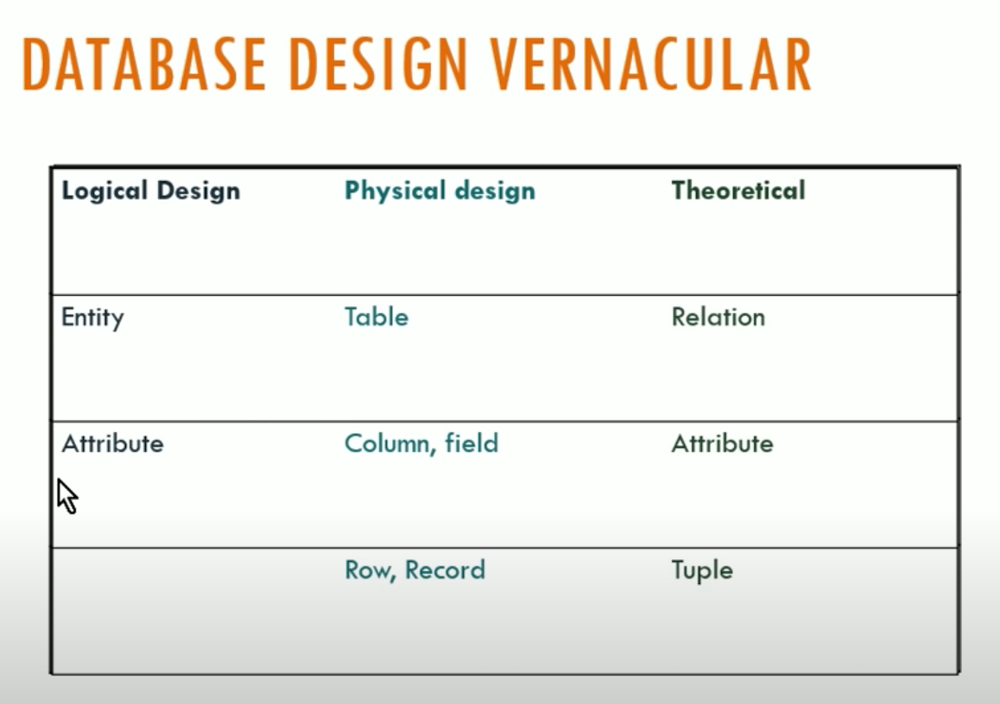
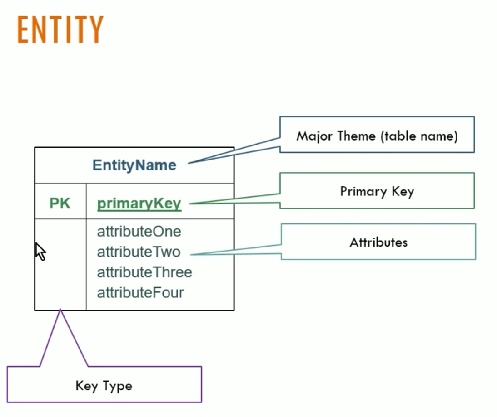
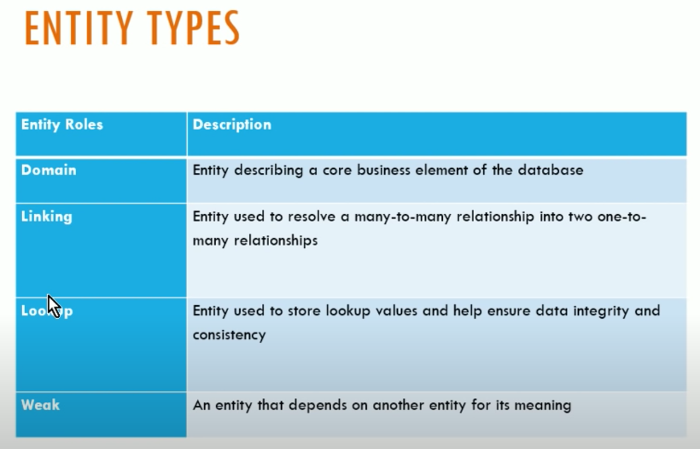
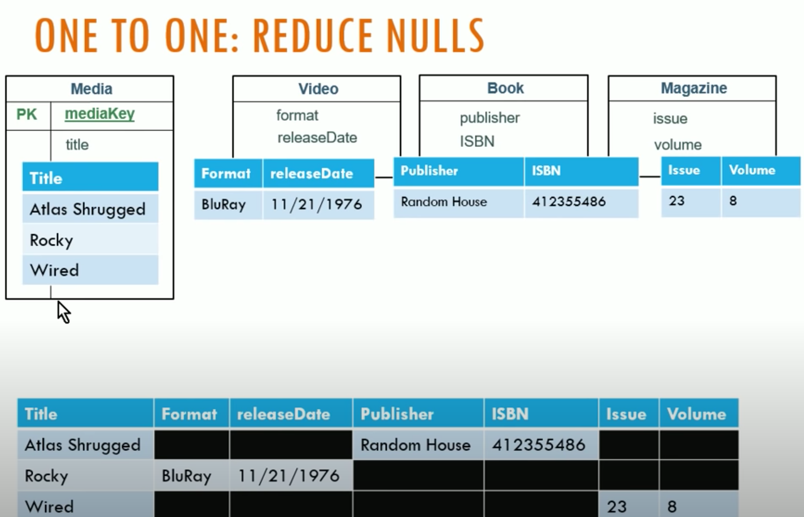
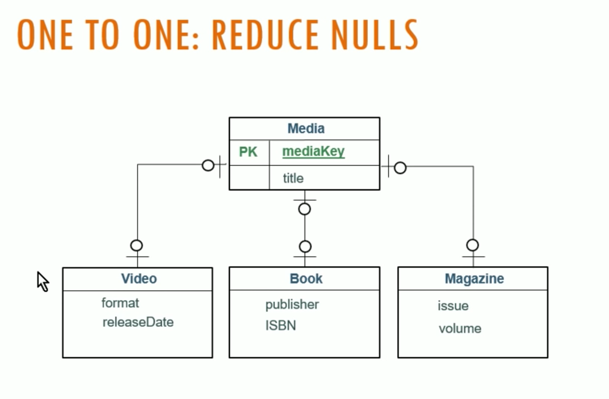
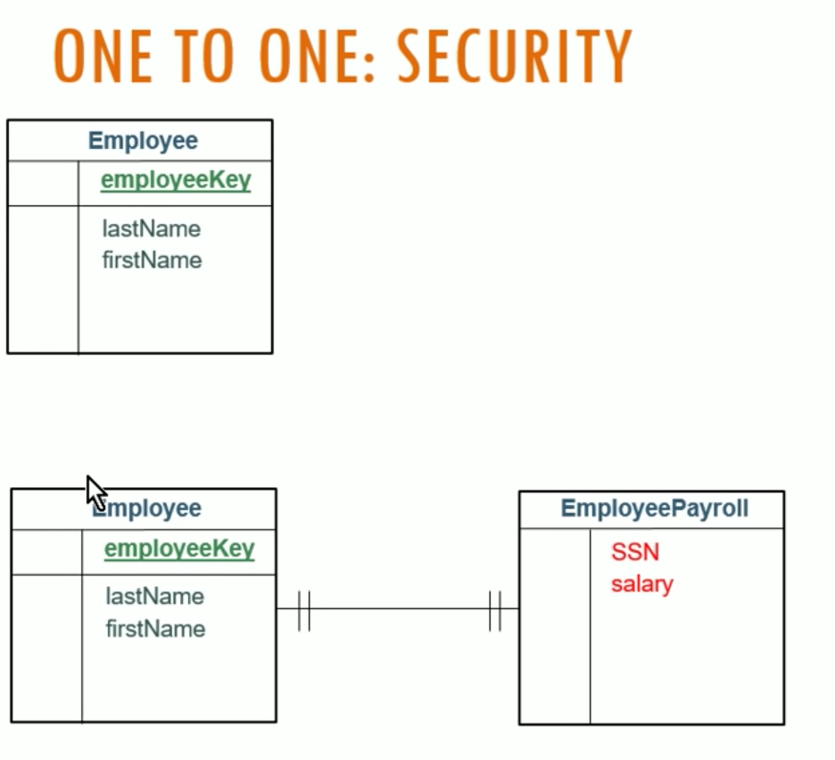
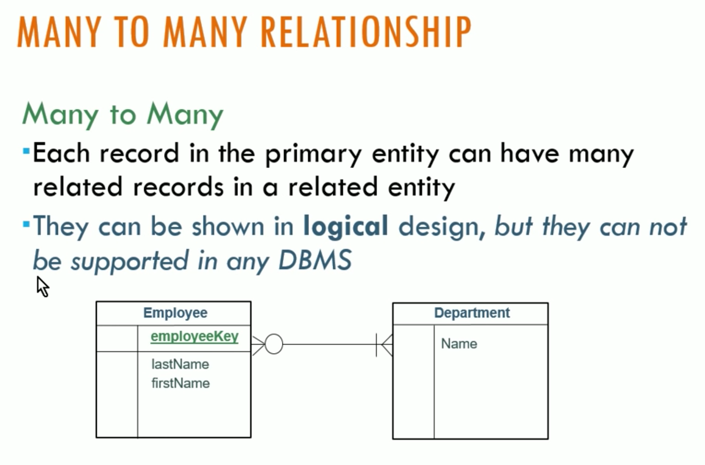

# Logical Database Design and E-R Diagrams
Notes from : https://www.youtube.com/watch?v=ZBgXb66Ckz0

* Logical Design
Entity design without regard to a relational database management sytem

* Physical Design
Limitation of the particular system

# Entity Relationships Diagrams (ERD)
modeling technique

Process:
person, place, things
* group nouns common themes (entities)
* other nouns (Attributes)
* primary Keys. uniquely identify

## Entity

### Entity Types

## One2One

for security reason

## One2Many

